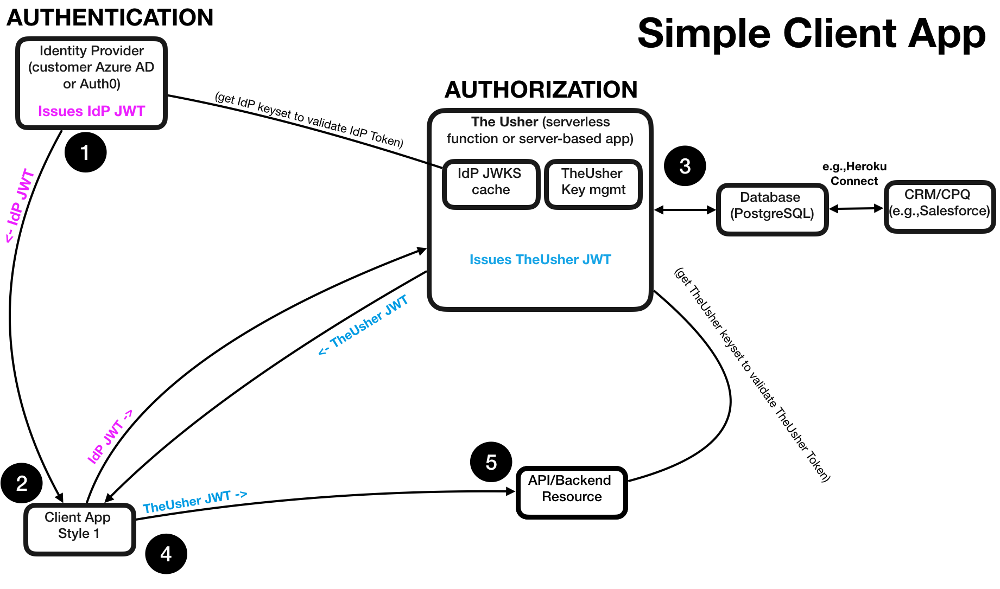

Welcome to a Client Web Application
=================

This is a secured web application that allows a user to authenticate themselves and get authorization to (and access) an arithmetic server API.  It demonstrates a simple scenario where TheUsher is used for authorization (see diagram below).

**User flow**: When you use this application you are first redirected to authenticate with credentials via an Auth0 tenant.  You then return to the application and can click a button to obtain authorization from TheUsher.  With this authorization in hand you can use the UI to perform arithmetic operations for which you are authorized.

## Deployed Test Instance

A test instance of this web application is served/hosted on Glitch.com: visit https://my-theusher-client.glitch.me/  .

It is configured to use our DMGT-Test Auth0 tenant and our test instance of TheUsher, where we have a test account set up:

* username XXXXXXX (contact the project owners if you'd like to use this account)
* password XXXXXXX (contact the project owners if you'd like to use this account)

This client uses a test instance of TheUsher that is automatically deployed to AWS (Lambda + RDS) via a Github Action. The backend resource arithmetic server that this client uses is hosted as a separate project on Glitch.com (https://glitch.com/~my-theusher-resourceserver).

The following diagram depicts the moving parts in this application (except that the TheUsher test instance in this case does **not** sync its PostgreSQL database with a CRM/CPQ database. The roles and permissions are simply inserted into the database via a db-init script.)

## Creating your own Instance(s)

You could optionally do any or all of the following:

1. Deploy and host the client app on your local machine or elsewhere (if locally, make sure localhost is allowed on the Auth0 tenant you are using and CORS has http://localhost:8000 in it)
2. Configure and use your own Auth0 tenant (make sure to point this client application to it, make sure your TheUsher instance is seeded with an authenticated user from your Auth0 tenant)
3. Deploy your own TheUsher instance (ensure it contains a permissioned user from our DMGT-Test Auth0 tenant or your tenant)
4. Deploy your own backend arithmetic server (make sure to point this client application to it).

## Configuring your own Auth0 Tenant

1. Set up a client Auth0 Application, e.g., called something like *Glitch Client Application* with the following parameters:

* Settings
  * Native Application
  * Callbacks: https://my-theusher-client.glitch.me/ (or wherever you are hosting the app; could be http://localhost:8000)
  * Web Origins: https://my-theusher-client.glitch.me ( """ )
  * CORS: https://my-theusher-client.glitch.me ( """ ; **NOTE: just the host domain, no URL paths**.)
* Connections: Username-Password-Authentication / Database On.

2.  Create an Auth0 "API" to represent that you will be calling The Usher. The Identifier will be the Audience the client app will use when requesting an access token from Auth0.

* Name: "TheUsher Server for Glitch Web App"
* Identifier: "https://the-usher-instance-0001"
* Signing Algorithm: "RS256"

3. Under Users and Roles click +CREATE USER and create a user with Username-Password-Authentication (this is where you might create test-user1@dmgtoocto.com).

## Configuring your own TheUsher instance

* You'll need to set up your TheUsher instance with roles and permissions for the user (identified by the sub-claim in their IdP access token; looks like auth0|nnnnnnnn).

Set up a user like test-user1@dmgtoocto.com for tenant dmgt-test.auth0.com, with roles and permissions for client app test-client1.
