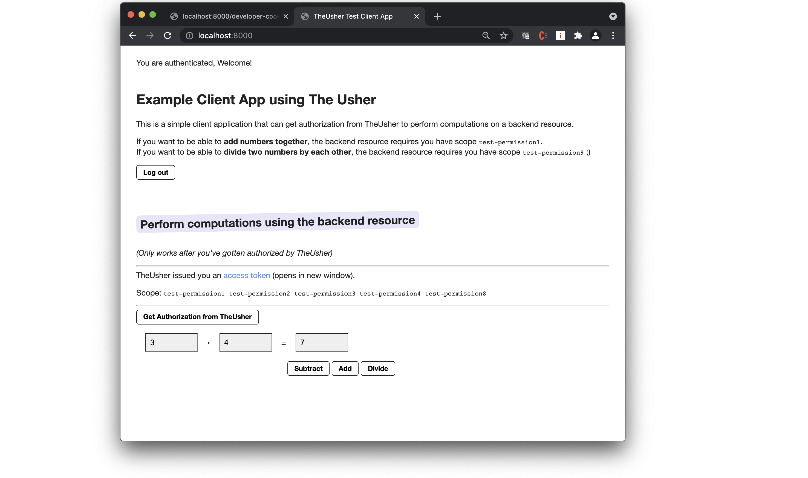

Demo Client Web Application for The Usher
=================

This is a secured web application that allows a user to authenticate themselves and get authorization to (and access) an arithmetic server API.  It demonstrates a simple scenario where TheUsher is used for authorization (see diagram below).

The default usage for this app is to have Auth0 set up as the IdP.  However, you have the option of running this app without Auth0, just using a local instance of the mock identity server.  Depending on which one you choose, there are slightly different user flows:

* **User flow with Auth0**: When you visit the app, you are first redirected to authenticate with credentials via an Auth0 tenant.  You then return to the application and can click a button to obtain authorization from TheUsher.  With this authorization in hand you can use the UI to perform arithmetic operations for which you are authorized.
* **User flow without Auth0**: You'll use curl to obtain the IdP token from the mock identity server, and manually add it into the browser. You then return to the application and can click a button to obtain authorization from TheUsher.  With this authorization in hand you can use the UI to perform arithmetic operations for which you are authorized.

Here's what the app looks like:




## Usage (local without Auth0)

The mock identity server included with The Usher does not have a login page. So, we cannot use the usual "redirect" flow for logging in and getting the IdP token. You will manually copy and set the IdP token in your browser (this step is included below).

1. Set up [the-usher-server](https://github.com/DMGT-TECH/the-usher-server).
   1. In `./the-usher-server/server/.env` add `http://localhost:3002/` in `ISSUER_WHITELIST`.
   1. Also, add an alias mapping entry in `ISSUER_ALIASES`, `{"http://localhost:3002/": "http://idp.dmgt.com.mock.localhost:3002/"}`
   1. Launch The Usher's developer configuration with `cd the-usher-server; docker-compose up`.
2. Clone [the-usher-democlient](https://github.com/DMGT-TECH/the-usher-democlient). Serve it locally with `cd the-usher-democlient; python3 -m http.server`.
3. Clone [the-usher-demoresource](https://github.com/DMGT-TECH/the-usher-demoresource). Launch it locally with `cd the-usher-demoresource; PORT=9000 npm start`.
4. Get an IDP token from The Usher's mock identity server:

```
export IDP_TOKEN=`./the-usher-server/server/scripts/get_idp_token_from_mockserver.sh | jq --raw-output .access_token`
```

5. Echo the `IDP_TOKEN` and set it in your browser using http://localhost:8000/developer-cookies.html
6. Open the client application at http://localhost:8000/
7. Click the "Get Authorization from The Usher" button.
8. Clicking the add, subtract, and divide buttons will use The Usher token in the request to the local resource server.


Optionally, instead of step 7 above, you could also manually get an access token from The Usher and set its coookie using the same `developer-cookies.html` page:

```
export THE_USHER_TOKEN=`curl -X POST "http://localhost:3001/self/token" -H "Content-type: application/json" -H "Authorization: Bearer $IDP_TOKEN"  -H "client_id: test-client1" | jq --raw-output .access_token`
```


## Using Auth0 instead of the Mock Identity Server


You can use this application with Auth0 as an identity provider, even if running and developing locally.


1. Set up a client Auth0 Application, e.g., called something like *TheUsher Client Application* with the following parameters:

* Settings
  * Native Application
  * Callbacks: https://my-theusher-client.glitch.me/ (or wherever you are hosting the app; could be `http://localhost:8000`)
  * Web Origins: https://my-theusher-client.glitch.me ( """ )
  * CORS: https://my-theusher-client.glitch.me ( """ ; **NOTE: just the host domain, no URL paths**.)
* Connections: Username-Password-Authentication / Database On.

2.  Create an Auth0 "API" to represent that you will be calling The Usher. The Identifier will be the Audience the client app will use when requesting an access token from Auth0.

* Name: "TheUsher Server for Glitch Web App"
* Identifier: "https://the-usher-instance-0001"
* Signing Algorithm: "RS256"

3. Under Users and Roles click +CREATE USER and create a user with Username-Password-Authentication (this is where you might create test-user1@dmgtoocto.com).

### Update The Usher Database with your Auth0 User's `sub` claim

Once Auth0 is configured, you'll need to set up your The Usher instance so that roles and permissions are set for the Auth0 user (identified by the sub-claim in their IdP access token; looks like `auth0|nnnnnnnn`).  Inspect your IdP token, determine the sub claim, and update sub claim for the test persona in The Usher's database to match that sub claim.

